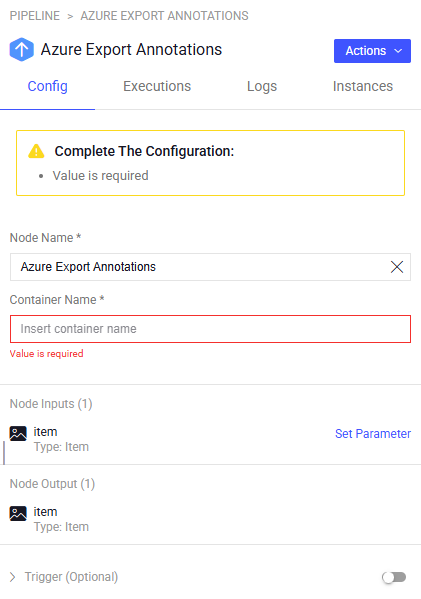

# Azure Hooks

The **Azure Hooks** application has two nodes to Export and Import annotation directly from Azure bucket.

## Quick Start:

1. Go to `Pipelines` and `Create new pipeline`.
2. Build a custom work flow that requires Export/Import annotations to/from Azure container
3. Define the bucket name in the node configuration panel.
4. Start pipeline

Pre-requirements: The Azure-hooks service needs an integration of `AZURE_API_KEY` that can be one of both:
*  Secrete name that holds the azure connection string.
*  Name of predefined integration to Azure blob

## Node inputs and Outputs:

Both Azure-hooks 2 nodes get the same item as input and output

## How it works:

### Export Annotations to Azure
When an item passes through the node, the node will export the item annotations to a json file and upload it to the Azure bucket. \
The file will be uploaded to the following location: \
`<driver_path>/<item.dir>/<item.name>.json`

### Import Annotations from Azure
When an item passes through the node, the node will download the item JSON annotations file from the Azure bucket and update the item with the new annotations. \
The file will be downloaded from the following location: \
`<driver_path>/<item.dir>/<item.name>.json`

## Setting Up Your Azure Project

To use these nodes, you need an Amazon Web Services (Azure) project. Follow these steps to get started: \
[Azure Private Key Integration](https://docs.dataloop.ai/docs/private-key-integration)

## Integrating Azure Export & Import API with Dataloop Platform

- Visit the [Dataloop Marketplace](https://docs.dataloop.ai/docs/marketplace), under Applications tab.
- Select the application and click on "Install" and then "Proceed".
  
- Select an existing Azure integration or add a new one by creating an Azure integration with `key` and `secret`.
  
- Install the application.
  

## Node Configuration TBD:

**Configuration**

- **Node Name:** The display name on the canvas.
- **Container Name:** The container name to export/import the annotations

## Contributions, Bugs and Issues - How to Contribute

We welcome anyone to help us improve this app.  
[Here's](CONTRIBUTING.md) a detailed instructions to help you open a bug or ask for a feature request.